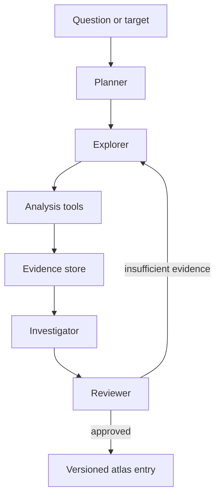

# AppAtlas

**A versioned, evidence-first knowledge base for software that public documentation does not adequately explain.**

AppAtlas helps humans and AI agents understand internal, institutional, legacy, and otherwise poorly documented software without turning guesses into facts. It combines public documentation, static analysis, runtime observations, and reproducible experiments into structured records whose claims can be traced back to evidence.

> AppAtlas is not another Ghidra bridge. Existing Ghidra integrations already provide decompilation, symbols, cross-references, call graphs, data-flow analysis, and headless automation. AppAtlas is the layer above them: a standard for converting observations into reviewable, versioned software knowledge.

## Why AppAtlas?

AI agents are increasingly expected to operate unfamiliar software, but their knowledge is often incomplete, outdated, or inferred from unrelated versions. Conventional documentation also tends to omit the details that agents need most: hidden workflows, component boundaries, version-specific behavior, and the evidence behind each claim.

AppAtlas is designed around four principles:

1. **Evidence before confidence** — every non-trivial claim should point to observable evidence.
2. **Version everything** — software behavior, binaries, interfaces, and conclusions may all change between releases.
3. **Separate fact from inference** — observations, hypotheses, and verified conclusions are different data types.
4. **Make uncertainty explicit** — unknown or ambiguous results are valid outputs, not failures to be hidden.

## What belongs in an atlas entry?

An entry describes one software component, behavior, interface, or workflow for a specific version. A minimal record might look like this:

```yaml
schema_version: 0.1
software:
  name: Example App
  version: 3.2.1
  platform: android
  artifact_sha256: "..."

subject:
  id: auth.token_refresh
  kind: behavior
  title: Token refresh flow

claims:
  - id: claim-001
    statement: The client requests a new access token after receiving an expired-token response.
    status: supported
    confidence: 0.86
    evidence:
      - evidence-001
      - evidence-002

evidence:
  - id: evidence-001
    type: string_reference
    tool: ghidra
    location: libapp.so:0x00123456
    value: refresh_token
    reproducibility: analysis/scripts/extract-auth-strings.py

  - id: evidence-002
    type: runtime_observation
    environment: Android 16 emulator
    procedure: observations/token-refresh.md
    artifact: captures/token-refresh.har

limitations:
  - Server-side behavior was not inspected.
  - Symbols were stripped; function names are analyst-assigned.

review:
  state: needs_review
  reviewed_by: []
```

The schema is intentionally strict about provenance while remaining tool-agnostic. Ghidra, JADX, browser automation, network captures, screenshots, public manuals, and controlled experiments can all contribute evidence.

## System overview



### Agent roles

- **Planner** scopes the question, software version, allowed methods, and required evidence.
- **Explorer** collects candidate observations from documentation, binaries, interfaces, and runtime behavior.
- **Investigator** connects evidence to narrowly worded claims and records competing explanations.
- **Reviewer** checks provenance, reproducibility, version alignment, and whether confidence exceeds the evidence.

These are logical roles rather than mandatory separate models. A small deployment may run them sequentially with one model; a larger deployment may use isolated agents and independent reviewers.

## Evidence model

AppAtlas distinguishes four levels:

| Level | Meaning | Example |
|---|---|---|
| Observation | Directly captured output | A binary contains the string `refresh_token` |
| Inference | Plausible interpretation | A nearby function may handle token refresh |
| Supported claim | Multiple aligned pieces of evidence | The client refreshes tokens through a particular request path |
| Verified behavior | Reproduced under a documented procedure | The behavior occurs in version 3.2.1 on the recorded environment |

Confidence scores never replace evidence. They communicate uncertainty within the same evidence class; they are not proof.

## Planned repository layout

```text
appatlas/
├── schema/                 # Versioned schemas and validators
├── atlases/                # Software-specific knowledge records
│   └── <software>/
│       └── <version>/
├── evidence/               # Small, redistributable evidence artifacts
├── observations/           # Reproduction procedures and lab notes
├── adapters/               # Ghidra, JADX, browser, and capture adapters
├── agents/                 # Prompts, policies, and orchestration
├── benchmarks/             # Groundedness and extraction evaluations
├── docs/                   # Design notes and contributor guides
└── tests/                  # Schema and evidence-integrity tests
```

Large binaries, proprietary packages, credentials, personal data, and material that cannot legally be redistributed must not be committed. Entries should reference hashes and locally reproducible procedures instead.

## Scope and non-goals

AppAtlas aims to support:

- poorly documented internal or institutional applications;
- legacy and abandoned software;
- version-to-version behavior tracking;
- AI-assisted static and dynamic analysis;
- reusable, auditable knowledge for support, migration, interoperability, and research.

AppAtlas does **not** aim to:

- replace existing reverse-engineering tools or their integrations;
- publish secrets, credentials, personal data, or proprietary binaries;
- bypass authorization, access controls, licensing, or platform security;
- present model-generated interpretations as established facts;
- provide a universal exploit-development framework.

Only analyze software and systems that you own or are authorized to inspect. Contributors are responsible for following applicable laws, licenses, institutional policies, and disclosure procedures.

## Roadmap

### Phase 0 — Foundations

- [ ] Define claim, evidence, artifact, version, and review schemas
- [ ] Add JSON Schema validation and example records
- [ ] Specify confidence and evidence-quality rules
- [ ] Define redaction and redistribution policies

### Phase 1 — Single-app pipeline

- [ ] Import findings from an existing Ghidra integration
- [ ] Preserve addresses, hashes, tool versions, and analysis settings
- [ ] Generate a draft atlas entry from collected evidence
- [ ] Require review before publishing supported claims

### Phase 2 — Reproducibility and evaluation

- [ ] Add deterministic extraction scripts
- [ ] Detect stale claims when an application version changes
- [ ] Benchmark unsupported-claim rate and evidence coverage
- [ ] Test whether another analyst can reproduce each verified behavior

### Phase 3 — Collaboration

- [ ] Add pull-request templates for new evidence and disputed claims
- [ ] Support competing hypotheses without overwriting history
- [ ] Build searchable indexes for agents and humans
- [ ] Publish reference adapters and starter atlases

## How to contribute

The project is at the design stage. Useful early contributions include:

- proposing minimal schemas that remain readable in Git diffs;
- supplying sanitized examples from authorized analysis;
- testing adapters for existing Ghidra or JADX automation;
- designing benchmarks for hallucination, provenance, and version drift;
- reviewing the legal, privacy, and disclosure model.

When contributing an entry:

1. Identify the exact software version and artifact hash.
2. Record the tool version and relevant analysis settings.
3. Keep observations separate from interpretations.
4. Attach or reference reproducible evidence for every claim.
5. State limitations and plausible alternative explanations.
6. Remove secrets, personal information, and non-redistributable material.

## Project status

AppAtlas is an early-stage specification and prototype. The schema and repository layout will change as the first end-to-end atlas is built. Until a stable release is tagged, do not treat draft records as authoritative documentation.

## License

No license has been selected yet. Until a license file is added, all rights are reserved by the copyright holder. Contributions should not be submitted until the project adopts an explicit contribution and licensing policy.

---

**AppAtlas turns “the model thinks this is true” into “here is the claim, the version, the evidence, and what remains uncertain.”**
